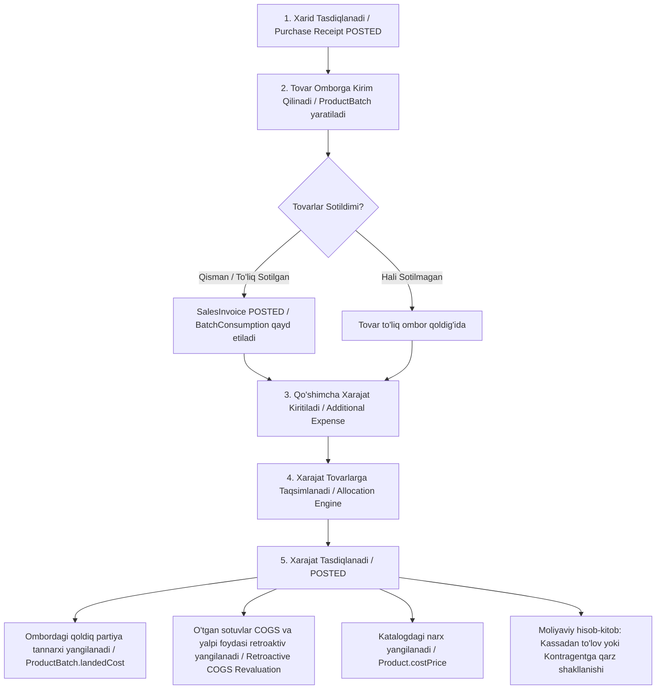

# Qo‘shimcha Xarajatlar va Tannarx (Landed Cost) Moduli Spetsifikatsiyasi

Ushbu spetsifikatsiya xarid qilingan tovarlar va xom ashyolar bilan bog‘liq transport, bojxona, brokerlik, sug‘urta va yuklash-tushirish kabi qo‘shimcha xarajatlarni hisobga olish, ularni tovarlar tannarxiga taqsimlash hamda qisman yoki to‘liq sotilgan tovarlar uchun sotuvlar tannarxini (COGS) va foyda/zararni retroaktiv qayta hisoblash tizimini belgilaydi.

---

## 1. Asosiy Biznes Jarayoni

---

## 2. Kelishilgan Arxitektura Qarorlari (Grilling & ADR Summary)

1. **Retroaktiv COGS qayta hisoblash (ADR 0008)**: Xarajat partiya tovarlari sotilgandan keyin kiritilsa ham, xarajat proporsional taqsimlanadi. Omborda qolgan qism partiya tannarxiga (`ProductBatch.landedCost`), sotilgan qism esa o‘tgan sotuvlar tannarxiga (`SalesInvoiceItem.unitCogs / lineCogs`) va yalpi foydasiga (`grossProfit`) retroaktiv ta'sir qiladi.
2. **Batch Consumption Audit modeli**: Qaysi sotuv aynan qaysi xarid partiyasidan ketganini 100% aniq bilish uchun har bir sotuvda `BatchConsumption` yozuvi saqlanadi.
3. **Ketma-ket cheksiz xarajatlar (Multi-Expense Chaining)**: Bitta xaridga bir nechta mustaqil xarajat hujjatlari (masalan: 1-kuni transport, 3-kuni bojxona) kiritilishi mumkin.
4. **Tiyin/qoldiq yaxlitlash qoidasi (Allocation Remainder Rule)**: Taqsimlashdagi 1 tiyinlik farqlar avtomatik eng katta summali tovar qatoriga biriktirilib, taqsimot yig‘indisi xarajat summasiga 100% teng bo‘lishi ta'minlanadi.
5. **Moliya va To‘lov**: Xarajat yaratishda darhol kassa/bank tanlansa to‘lov amalga oshiriladi (`FinanceTransaction`), tanlanmasa kontragentga qarz (`debtBalance`) yoziladi.
6. **Rollback Guardrail**: Xarajat bekor qilinganda (`CANCELLED`), unga bog‘liq to‘lov mavjud bo‘lsa, avval to‘lov bekor qilinishi shart. Partiya va sotuvlar tannarxi esa avvalgi holatiga xavfsiz qaytariladi.
7. **Mahsulot narxi sinxronizatsiyasi (ADR 0007)**: Xarajat tasdiqlangach, oxirgi partiyaning yangi tannarxi `Product.costPrice` ga avtomatik yoziladi.

---

## 3. Ma'lumotlar Bazasi Modeli (Prisma Schema Additions)

### 3.1. `AdditionalExpense` (Qo‘shimcha xarajat hujjati)
- `id`: String (UUID, PK)
- `tenantId`: String (FK -> Company)
- `docNumber`: String (Masalan: `EXP-2026-0001`)
- `docDate`: DateTime
- `status`: PurchaseDocStatus (`DRAFT`, `POSTED`, `CANCELLED`)
- `expenseType`: ExpenseType (`TRANSPORT`, `CUSTOMS`, `BROKER`, `INSURANCE`, `OTHER`)
- `counterpartyId`: String (FK -> Counterparty, xizmat ko‘rsatuvchi tashkilot)
- `receiptId`: String (FK -> PurchaseReceipt)
- `amount`: Decimal (Xarajatning umumiy summasi)
- `currency`: String (Standart: `UZS`)
- `exchangeRate`: Decimal (Standart: 1.0)
- `vatRate`: Decimal (Standart: 0%)
- `vatAmount`: Decimal (Standart: 0)
- `allocationMethod`: ExpenseAllocationMethod (`BY_AMOUNT`, `BY_QUANTITY`, `BY_WEIGHT`)
- `isPaid`: Boolean (To‘langanlik holati)
- `cashAccountId`: String? (To‘lov qilingan kassa/bank hisobi)
- `comment`: String?
- `createdById`: String?
- `postedById`: String?
- `postedAt`: DateTime?

### 3.2. `AdditionalExpenseItem` (Xarajat taqsimot qatori)
- `id`: String (UUID, PK)
- `expenseId`: String (FK -> AdditionalExpense)
- `receiptItemId`: String (FK -> PurchaseReceiptItem)
- `productId`: String (FK -> Product)
- `initialLandedCost`: Decimal (Xarajatdan oldingi tannarx)
- `allocatedAmount`: Decimal (Ushbu tovar qatoriga to‘g‘ri kelgan xarajat)
- `newLandedCost`: Decimal (Xarajatdan keyingi yangi tannarx)
- `soldQuantity`: Decimal (Hozirgacha sotilgan miqdor)
- `remainingQuantity`: Decimal (Omborda qolgan miqdor)
- `cogsAdjustment`: Decimal (Sotilgan qismga to‘g‘ri keluvchi COGS o‘zgarishi)

### 3.3. `BatchConsumption` (Partiya iste'moli audit jadvali)
- `id`: String (UUID, PK)
- `tenantId`: String (FK -> Company)
- `salesInvoiceItemId`: String (FK -> SalesInvoiceItem)
- `batchId`: String (FK -> ProductBatch)
- `quantity`: Decimal (Sotilgan miqdor)
- `unitCost`: Decimal (Sotuv paytidagi tannarx)
- `createdAt`: DateTime

---

## 4. Foydalanuvchi Interfeysi (UI/UX)

1. **`/purchases/expenses` (Asosiy sahifa)**:
   - **KPI Kartalari**: Jami transport, bojxona, brokerlik xarajatlari va umumiy taqsimlangan summa.
   - **Tablar**: 
     - *📋 Barcha Xarajatlar*: Qidiruv, status filtrlari (`DRAFT`, `POSTED`, `CANCELLED`), sana oralig‘i, kontragent va xarid bo‘yicha filtrlar.
     - *📊 Tannarxga Ta'siri va Tahlil*: Tovarlar kesimida xarid narxi, qo‘shimcha xarajatlar ulushi va yakuniy tannarx o‘sishi grafigi.
   - **Amallar**: "Yangi Xarajat" tugmasi, ko‘rish, tahrirlash, bekor qilish.

2. **`/purchases/expenses/new` (Yangi xarajat yaratish sahifasi)**:
   - **1-qadam**: Xarajat parametrlari (Sana, Turi, Kontragent, Valyuta, Summa, To‘lov holati).
   - **2-qadam**: Xaridni tanlash (`PurchaseReceipt` qidiruvi, sanasi, ombori va yetkazib beruvchisi bilan).
   - **3-qadam**: Tovarlarni tanlash va taqsimlash (Chekboxlar, Miqdor, Xarid narxi, Amaldagi tannarx, Taqsimot usuli: Qiymatiga / Miqdoriga / Vazniga qarab).
   - **4-qadam**: Tasdiqlashdan oldingi natija (Har bir tovar bo‘yicha eski tannarx, taqsimlangan xarajat, yangi tannarx, sotilgan va ombordagi qoldiq ulushi).

3. **`/purchases/expenses/[id]` (Hujjat tafsilotlari)**:
   - Xarajat holati, taqsimot jadvali, retroaktiv ta'sir ko‘rsatkichlari (qaysi sotuv hisob-fakturalari qayta hisoblangani), avtomatik buxgalteriya provodkalari (buxgalter/admin uchun) va bekor qilish (Unpost/Cancel) amali.
