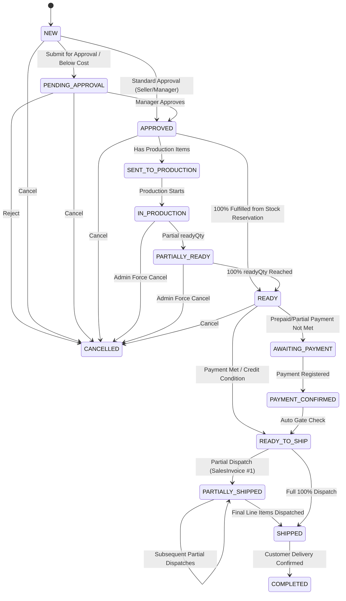

# Specification: Unified Sales and Orders Module (1C Logic & Simple Interface)

## 1. Problem Statement

In retail, distribution, and manufacturing businesses, sales operations take two distinct forms:
1. **Direct Immediate Sales (Oddiy Sotuv)**: A customer arrives, selects goods from warehouse inventory, pays immediately or takes on credit, and leaves with physical goods. Stock must decrease immediately, COGS must be calculated via FIFO, and revenue/debt recorded atomically.
2. **Sales Orders (Zakazlar)**: A customer requests goods that may not exist in full on the warehouse or require production. Recording a commitment must **NOT** decrement physical inventory or book revenue before goods are ready and dispatched. However, free inventory must be reserved so other sellers do not accidentally sell it. When items are ready, shipments can happen in parts (multi-dispatch), creating separate invoices per shipment.

Previously, disparate mechanisms caused:
- Premature inventory deduction and artificial revenue recognition before manufacturing was complete.
- Double-selling of available stock because committed orders did not reserve free inventory.
- Inability to dispatch orders in installments (partial shipments) with accurate FIFO batch costing.
- Disconnected cash desks leading to reconciliation issues between Sales and Finance.

---

## 2. Solution & 1C Accounting Principles

This module unifies **Direct Sales** and **Sales Orders** under 1C business logic while presenting an intuitive, non-accounting interface to employees (no complex debit/credit charts or manual provodkas exposed):
- **Ombor (Inventory) as the Single Source of Truth**: All acquisitions (purchases, production output) enter warehouse batches with landed cost. Direct sales decrease physical stock immediately. Orders reserve stock (`Free Stock = Physical Stock − Reserved Stock`) and only deduct physical batches upon explicit warehouse dispatch.
- **True FIFO Landed Cost & Profit Engine**: Profit is calculated in real time as `Gross Profit = Net Sales Revenue − Exact FIFO Batch Cost`.
- **Multi-Shipment (Qisman jo'natish)**: A single Sales Order can generate multiple `SalesInvoice` dispatches with custom quantities per line until 100% fulfilled.
- **Auto-Fulfillment & Production Gap**: Orders automatically reserve available free warehouse stock first and send only the remaining gap to the production schedule.
- **Triple Cash Desk Integration**: Finance payments directly route into **Naqd kassa (UZS)**, **Dollar kassa (USD)**, or **Hisobraqam (Bank)**, instantly reconciling counterparty balances.
- **Price & Cost Protection**: Selling below cost or exceeding discount thresholds automatically triggers manager approval gates (`PENDING_APPROVAL`).
- **Exact FIFO Cost Restoration on Returns**: Returned items are re-entered into inventory at the exact original unit cost from the dispatch batch.

---

## 3. User Stories by Role

### 3.1. Seller (Sotuvchi)
1. **Create Direct Sale**: As a seller, I want to create a direct sale by selecting a warehouse, viewing live available stock per item, selecting a customer, and entering quantities and discounts, so that goods are sold immediately.
2. **Stock Guard in Direct Sale**: As a seller, I want the system to block me from entering quantities exceeding available stock, so that we never over-sell warehouse inventory.
3. **Price Protection Alert**: As a seller, I want the system to warn me if my sale price is below cost price and route the document for manager approval (`PENDING_APPROVAL`), so that the business does not suffer unauthorized losses.
4. **Create Sales Order**: As a seller, I want to create a customer order specifying required items, agreed price, delivery date, and payment condition (`PREPAID_100`, `PARTIAL`, `CREDIT`) without immediately deducting physical stock.
5. **Customer Quick-Add**: As a seller, I want to quickly register a new customer via a drawer directly inside the sale or order form, so that I don't lose the customer during order intake.
6. **Track Order Pipeline**: As a seller, I want to see the order status progression (New $\to$ In Production $\to$ Ready $\to$ Shipped) and payment status in real time.

### 3.2. Production Worker (Ishlab chiqarish)
7. **Receive Production Orders**: As a production worker, I want to receive an automatic production stub for the unfulfilled portion of a Sales Order (`Order Qty − Reserved Stock`), so that I only manufacture what is missing.
8. **Record Output (Kirim)**: As a production worker, I want to enter output (`readyQty`), which increments ready quantities on the Sales Order and automatically transitions the order to `PARTIALLY_READY` or `READY`.
9. **Warehouse Kirim on Completion**: As a production worker, I want manufactured goods to be receipted into the designated warehouse with calculated production cost.

### 3.3. Finance Officer (Moliya)
10. **Record Payments by Cash Desk**: As a finance officer, I want to register customer payments against an Order or Invoice, choosing the destination cash desk (**Dollar kassa**, **Naqd kassa**, or **Hisobraqam**), updating counterparty debt balances immediately.
11. **Dispatch Gate Clearance**: As a finance officer, I want the system to check if advance payment requirements (100% or partial %) are met before unblocking the warehouse dispatch button.
12. **Credit Bypassing**: As a finance officer, I want orders with `CREDIT` condition to automatically bypass payment gates and proceed directly to `READY_TO_SHIP` once goods are ready.

### 3.4. Warehouse Worker (Ombor xodimi)
13. **View Authorized Dispatches**: As a warehouse worker, I want to see a queue of all Sales Orders that are `READY_TO_SHIP` or `PARTIALLY_SHIPPED`.
14. **Partial Dispatch Modal**: As a warehouse worker, I want to open a dispatch dialog, specify the exact quantities being loaded onto the truck for each line, and confirm dispatch.
15. **Automatic FIFO Invoice Creation**: As a warehouse worker, I want the system to atomically deduct inventory batches using FIFO, generate and post a `SalesInvoice`, increment customer AR, and update order remaining quantities.
16. **Sales Return Processing**: As a warehouse worker, I want to process returns against posted invoices, returning goods to inventory at original batch cost and decreasing counterparty debt.

### 3.5. Manager / Administrator (Rahbar)
17. **Approve Special Orders**: As a manager, I want to review and approve orders flagged for below-cost pricing or pending credit terms (`PENDING_APPROVAL` $\to$ `APPROVED`).
18. **Force Cancellation & Cascade**: As a manager, I want to cancel an order at any stage, automatically releasing reserved stock and cancelling linked production stubs.
19. **Executive Dashboard**: As a manager, I want to view a real-time dashboard with Daily/Monthly Sales, Gross Profit, Pipeline Funnel, Counterparty Receivables, and Warehouse Stock Valuation.

---

## 4. State Machine & Lifecycles

### 4.1. Sales Order Lifecycle (14 States)



---

## 5. Invariants & Business Rules

1. **No Physical Stock Movement on Order Creation**: A `SalesOrder` in `NEW` or `APPROVED` status never creates physical stock deductions or accounting AR.
2. **Stock Reservation Invariant**:
   $$\text{Free Stock} = \text{Physical Batch Stock} - \text{Reserved Stock}$$
   A direct sale cannot sell more than $\text{Free Stock}$.
3. **Auto-Fulfillment Priority**:
   - If $\text{Free Stock} \ge \text{Order Quantity}$, reserve 100% from warehouse; do not generate a production task.
   - If $\text{Free Stock} < \text{Order Quantity}$, reserve all available free stock ($R = \text{Free Stock}$) and dispatch production stub for $P = \text{Order Quantity} - R$.
4. **Dispatch Gate Rules**:
   - `PREPAID_100`: Requires $\text{paidAmount} \ge \text{totalAmount}$.
   - `PARTIAL`: Requires $\text{paidAmount} \ge \frac{\text{totalAmount} \times \text{requiredPaymentPercent}}{100}$.
   - `CREDIT`: Gate is permanently open ($\text{required} = 0$).
5. **Partial Dispatch Accounting**:
   - Each partial dispatch creates a distinct posted `SalesInvoice`.
   - The invoice calculates FIFO COGS and increments customer debt by the partial amount.
   - Any prior advance payments tied to the `orderId` are allocated towards the new invoice.
6. **Below-Cost Protection**: If any line item has $\text{unitPrice} \times (1 - \frac{\text{discount}}{100}) < \text{costPrice}$, saving the document forces status to `PENDING_APPROVAL`.

---

## 6. Data Model & Schema

```prisma
enum SalesOrderStatus {
  NEW
  PENDING_APPROVAL
  APPROVED
  SENT_TO_PRODUCTION
  IN_PRODUCTION
  PARTIALLY_READY
  READY
  AWAITING_PAYMENT
  PAYMENT_CONFIRMED
  READY_TO_SHIP
  PARTIALLY_SHIPPED
  SHIPPED
  COMPLETED
  CANCELLED
}

enum PaymentCondition {
  PREPAID_100
  PARTIAL
  CREDIT
}

enum CashRegisterType {
  CASH_UZS     // Naqd kassa
  CASH_USD     // Dollar kassa
  BANK_ACCOUNT // Hisobraqam
}

model SalesOrder {
  id                     String             @id @default(uuid())
  tenantId               String
  orderNumber            String
  status                 SalesOrderStatus   @default(NEW)
  counterpartyId         String
  assignedSellerId       String?
  currency               String             @default("UZS")
  exchangeRate           Decimal            @default(1.0)
  paymentCondition       PaymentCondition   @default(PREPAID_100)
  requiredPaymentPercent Decimal            @default(50.0)
  totalAmount            Decimal            @default(0.0)
  paidAmount             Decimal            @default(0.0)
  deliveryDate           DateTime?
  deliveryAddress        String?
  comment                String?
  createdAt              DateTime           @default(now())
  updatedAt              DateTime           @updatedAt

  counterparty           Counterparty       @relation(fields: [counterpartyId], references: [id])
  assignedSeller         User?              @relation(fields: [assignedSellerId], references: [id])
  items                  SalesOrderItem[]
  invoices               SalesInvoice[]
  productionOrders       ProductionOrder[]
  payments               Payment[]
  auditLogs              SalesOrderAuditLog[]
  reservations           StockReservation[]
}

model SalesOrderItem {
  id           String      @id @default(uuid())
  orderId      String
  productId    String
  quantity     Decimal
  unitPrice    Decimal
  discount     Decimal     @default(0.0)
  totalPrice   Decimal
  reservedQty  Decimal     @default(0.0)
  readyQty     Decimal     @default(0.0)
  shippedQty   Decimal     @default(0.0)

  order        SalesOrder  @relation(fields: [orderId], references: [id], onDelete: Cascade)
  product      Product     @relation(fields: [productId], references: [id])
}

model StockReservation {
  id           String      @id @default(uuid())
  tenantId     String
  orderId      String
  productId    String
  warehouseId  String
  quantity     Decimal
  createdAt    DateTime    @default(now())

  order        SalesOrder  @relation(fields: [orderId], references: [id], onDelete: Cascade)
  product      Product     @relation(fields: [productId], references: [id])
  warehouse    Warehouse   @relation(fields: [warehouseId], references: [id])
}
```

---

## 7. REST API Endpoints

### Sales Orders & Dispatch
| Method | Endpoint | Description |
|---|---|---|
| `POST` | `/api/sales/orders` | Create a new Sales Order |
| `GET` | `/api/sales/orders` | List Sales Orders with 8 filters & pagination |
| `GET` | `/api/sales/orders/:id` | Get single Sales Order with lines, invoices, logs |
| `PATCH` | `/api/sales/orders/:id` | Update Sales Order in `NEW` / `PENDING_APPROVAL` |
| `POST` | `/api/sales/orders/:id/transition` | Execute state transition (`SUBMIT`, `APPROVE`, `CANCEL`, etc.) |
| `POST` | `/api/sales/orders/:id/dispatch` | Execute partial or full warehouse dispatch |
| `POST` | `/api/sales/orders/:id/production-progress` | Update `readyQty` from production output |

### Direct Sales & Returns
| Method | Endpoint | Description |
|---|---|---|
| `POST` | `/api/sales/invoices` | Create & post direct sales invoice with stock check |
| `POST` | `/api/sales/returns` | Process sales return, restoring exact FIFO batch cost |
| `GET` | `/api/sales/stock-availability` | Query available free stock per warehouse & product |

### Finance & Payments
| Method | Endpoint | Description |
|---|---|---|
| `POST` | `/api/sales/payments` | Register payment with destination cash desk (`cashRegisterId`) |
| `GET` | `/api/finance/cash-registers` | List Dollar, Naqd, and Bank cash desks with balances |

---

## 8. Verification & Acceptance Criteria

1. **Direct Sale Stock Guard**: Submitting a sale with $\text{quantity} > \text{available free stock}$ is rejected with HTTP 400 and clear error message.
2. **Reservation Separation**: Creating and approving an order for 20 units decreases $\text{Free Stock}$ by 20 without creating an inventory ledger decrement.
3. **Multi-Dispatch Integrity**:
   - Dispatching 300 units out of a 500-unit order creates an invoice for 300 units with 300 units FIFO consumption.
   - The Sales Order transitions to `PARTIALLY_SHIPPED`, leaving 200 units remaining.
   - Dispatching the remaining 200 units transitions the order to `SHIPPED`.
4. **Exact Cost Restoration**: Returning a 10-unit line item creates an inventory batch receipt with the exact unit cost from the original dispatch batch.
5. **Cash Desk Integration**: Recording a \$1,000 payment increases Dollar Kassa by \$1,000 and reduces customer balance by \$1,000.
6. **Price Protection Gate**: Selling below cost forces status to `PENDING_APPROVAL`.
